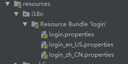
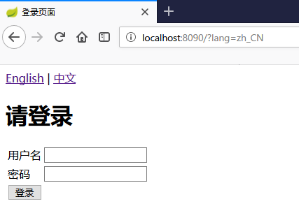
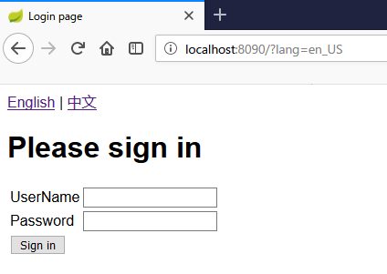

# Spring Boot实战：国际化配置
springboot国际化(在[springboot](https://lidawei2019.github.io/springboot/)的基础上加入国际化配置)

## 加入国际化配置的方法

### 1，创建资源文件
格式：文件名_区域_语言.properties；当我们这样命名生成文件后，IDEA也会帮我们识别这是个国际化配置包，自动转换成如下的模式：



login.properties：无语言配置时生效；login_zh_CN.properties：中文生效；login_en_US.properties：英文生效；

### 2，配置文件中指定资源文件
在我们的application.properties中添加配置参数，让我们的配置生效：
多个资源时用逗号分隔
```
spring.messages.basename=i18n.login
```

### 3，视图（Thymeleaf）中使用key来获取国际化内容
```
<html xmlns="http://www.w3.org/1999/xhtml" xmlns:th="http://www.thymeleaf.org">
	<body>
		<h1 th:text="#{login.tip}">请登录</h1>
		<form action="login" method="post">
			<table>
				<tr>
					<td th:text="#{login.username}">用户</td>
					<td><input type="text" name="loginName" id="loginName"/></td>
				</tr>
				<tr>
					<td th:text="#{login.password}">密码</td>
					<td><input type="text" name="password" id="password"/></td>
				</tr>
				<tr>
					<td colspan="2"><input type="submit" value="登录" th:value="#{login.btn}"/></td>
				</tr>
			</table>
		</form>
	</body>
</html>
```
将所有需要的参数用#{xx.yy}的形式，按照配置的国际化参数都设置好，为了使用模板，我们需要用到th:text之类的参数来替换原来的参数。

 而为了使Thymeleaf模板生效，别忘了在html的参数中加上这句xmlns：
```
<!DOCTYPE html>
<html lang="en" xmlns:th="http://www.thymeleaf.org">
```
### 4，浏览器语言切换
SpringBoot默认是按照你浏览器的语言来切换中英文的，这样，我们就可以在切换浏览器语言的情况下，进行中英文切换了

## 想要在页面中切换语言的情况
### 1，HTML中加入切换链接
```
<a href="?lang=en_US">English</a> | <a href="?lang=zh_CN">中文</a>
```
### 2，启动类中加入配置
```
    @Bean
    public LocaleResolver localeResolver() {
        SessionLocaleResolver slr = new SessionLocaleResolver();
        // 默认语言
        slr.setDefaultLocale(Locale.SIMPLIFIED_CHINESE);
        return slr;
    }

    @Bean
    public LocaleChangeInterceptor localeChangeInterceptor() {
        LocaleChangeInterceptor lci = new LocaleChangeInterceptor();
        // 参数名
        lci.setParamName("lang");
        return lci;
    }

    @Override
    public void addInterceptors(InterceptorRegistry registry) {
        registry.addInterceptor(localeChangeInterceptor());
    }
```

### 3，效果
http://localhost:8090/?lang=zh_CN


http://localhost:8090/?lang=en_US


## ※返回到前台的message怎么实现国际化
### 1，配置ResourceBundleMessageSource
配置语言及application.properties中设置的basename
```
@Configuration
public class InternationalConfig {
    @Value(value = "${spring.messages.basename}")
    private String basename;

    @Bean(name = "messageSource")
    public ResourceBundleMessageSource getMessageResource() {
        ResourceBundleMessageSource messageSource = new ResourceBundleMessageSource();
        ((ResourceBundleMessageSource) messageSource).setDefaultEncoding("UTF-8");
        String[] basenames = basename.split(",");
        for (String name : basenames) {
            messageSource.addBasenames(name);
        }
        return messageSource;
    }
}
```

### 2，根据key获取国际化信息
```
@Component
public class MessageSourceHandler {
    @Autowired
    private MessageSource messageSource;

    @Value(value = "${spring.messages.basename}")
    private String basename;

    /**
     * 根据Kye取国际化的值
     */
    public String getMessage(String messageKey) {
        String[] basenames = basename.split(",");
        String message = messageSource.getMessage(messageKey, basenames, LocaleContextHolder.getLocale());
        return message;
    }
}
```

### 3，提供util工具类
```$xslt
@Component
public class I18nUtils {
    private static MessageSourceHandler handler;

    @Autowired
    public I18nUtils(MessageSourceHandler handler) {
        I18nUtils.handler = handler;
    }

    /**
     * 根据Kye取国际化的值
     */
    public static String getMessage(String messageKey) {
        String message = handler.getMessage(messageKey);
        return message;
    }
}
```

### 4，可以调用啦
```
I18nUtils.getMessage("login.success");
```

#### 参考文献

[SpringBoot日记——国际化篇](https://www.cnblogs.com/iceb/p/9225678.html)

[使用spring boot 实现返回信息国际化记录](https://blog.csdn.net/lcl249847947/article/details/53260306)
